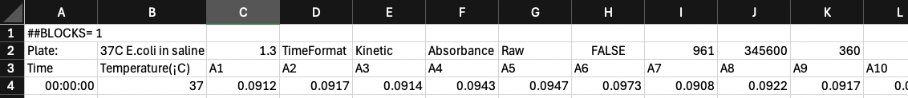
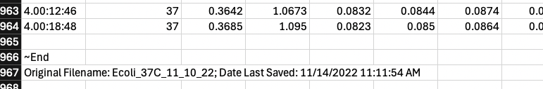
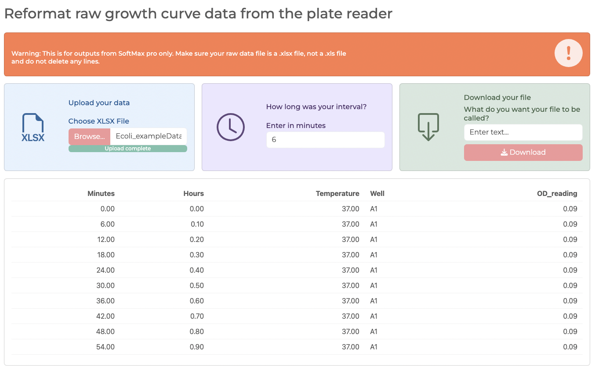
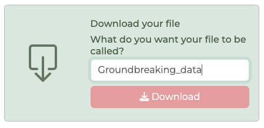

## gc_formatrr

This app takes my script, growth_curve_format, and gives it a nice GUI. It specifically takes raw xlsx growth curve data from SoftMax Pro, the software that is associated with Molecular Devices plate readers. It will take the data, make it "longer", and adds a nicely formatted minutes and hours column. Users can then download the properly formatted data as an xlsx for further analysis and graphing.

This was intended for use in microbiology, but any kinetic experiment in SoftMax Pro should work. I wrote this app specifically for my lab to use since most members shy away from using R directly.  

[Link to the app](https://ahrouj-andrea0domen.shinyapps.io/gc_formatrr/)

## Instructions
**Note**: An example data file is included in this repo in case you run into any issues with your own data (Ecoli_exampleData.xlsx).

**1. Export your data**

Typically when exporting from SoftMax Pro, it will spit out a file in xls format. This needs to be changed to xlsx. To save as an xlsx, open your xls file, use "Save As" and change the file type to xlsx.

Additionally, when exporting, SoftMax Pro will include 2 lines in the beginning that look like this (also note the (¡C) after Temperature):

Plus 1 empty line and 2 lines of stuff at the end:

**If any of these are removed, the app will not work.** If you did accidentally remove them, just insert two rows at the beginning of your data and just type something in the three rows at the end of your data. If you deleted the (¡C) after Temperature, just add it back in.

Now your data is ready!

**2.  Open the app**

Use the link or run the app.R file in R Studio. 

This is what you should see:

**3. Upload your data**
Click the "Browse" button in the blue box and find your xlsx data file.

**4. Enter your interval**
The app defaults to a 10 minute interval, just like SoftMax Pro. If your experiment had a different interval, make sure to change it. If changed, the app will automatically update the data and give you a preview of the first 10 lines. Using the example data which had an interval of 6 minutes will look like this:

**5. Enter your file name and download**
Finally, enter whatever you want your file name to be. No need to add .xlsx at the end. Then click download.

